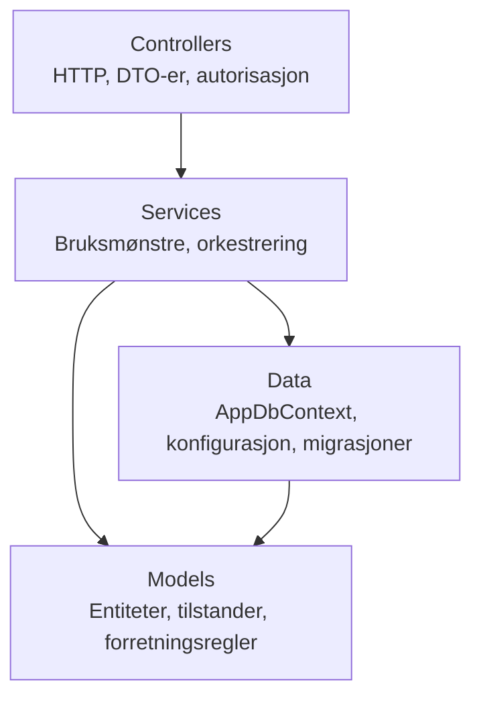
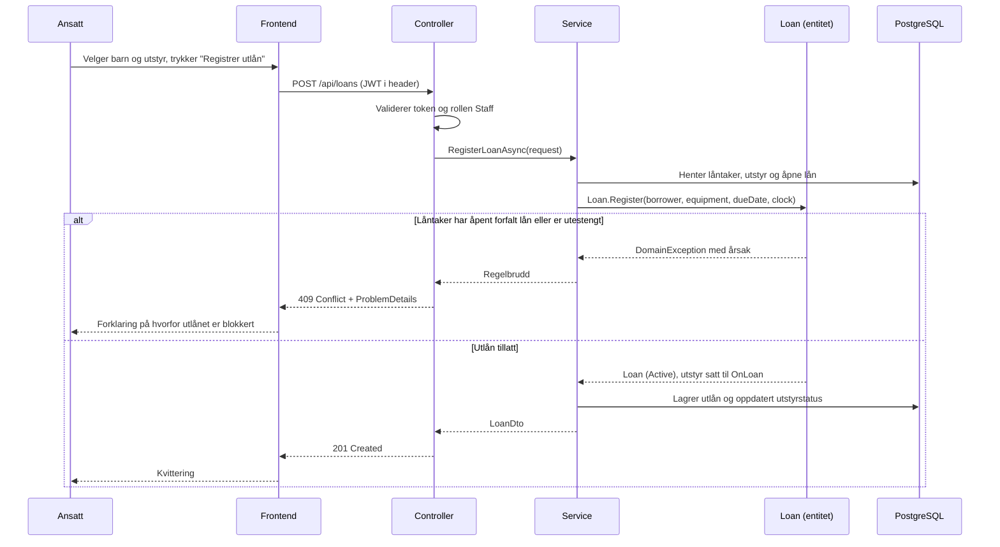

# Arkitektur

## Overordnet

Systemet er en trelagsapplikasjon: en frontend, et backend-API og en database.
Alt ligger i ett repositorium (monorepo). Under utvikling kjøres frontend og
backend lokalt, mens databasen kjøres i Docker.


Frontend snakker aldri med databasen direkte. All datatilgang går gjennom API-et,
slik at forretningsreglene håndheves ett sted.

## Hvorfor monorepo

Frontend og backend ligger i samme repositorium fordi de utvikles av én person i
ett tempo og endres ofte sammen. Et endepunkt og siden som bruker det kan da
endres i samme commit, og CI kan bygge og teste hele systemet mot samme versjon.
Se [ADR-0001](./adr/0001-monorepo.md).

```
Fagprove/
├── backend/          .NET-løsning
├── frontend/         Next.js-applikasjon
├── docs/             Dokumentasjon (denne mappen)
├── .claude/          AI-instrukser og skills
├── .github/          CI-pipeline
└── docker-compose.yml
```

## Backend: lagdeling

Backend er **ett prosjekt** der lagene skilles med mapper, ikke med separate
prosjekter. Begrunnelsen, og alternativene som ble vurdert, står i
[ADR-0012](./adr/0012-lagdelt-monolitt.md).



| Mappe | Ansvar |
| --- | --- |
| `Controllers/` | HTTP-endepunkter, modellvalidering, autorisasjon, feilhåndtering. Kaller services, aldri `AppDbContext`. |
| `Services/` | Bruksmønstre som "registrer utlån" eller "registrer retur". Eneste laget som bruker `AppDbContext`. |
| `Models/` | Entiteter med tilstand og forretningsregler. Ingen avhengighet til HTTP eller EF Core-oppsett. |
| `Dtos/` | Objektene som krysser API-grensen. Entiteter eksponeres aldri direkte. |
| `Data/` | `AppDbContext`, `IEntityTypeConfiguration`-klasser og migrasjoner. |
| `Mapping/` | Konvertering mellom entiteter og DTO-er. |
| `Validation/` | Validering av innkommende forespørsler. |
| `Middleware/` | Tverrgående håndtering, blant annet feilrespons som `ProblemDetails`. |
| `Configuration/` | Sterkt typede innstillinger bundet fra konfigurasjon. |
| `Helpers/` | Små hjelpefunksjoner uten eget lag. |

Filstruktur:

```
backend/
├── SportForAlle.sln
├── SportForAlle.Api/
│   ├── Program.cs
│   ├── appsettings.json
│   ├── appsettings.Development.json
│   ├── Controllers/
│   │   └── HealthController.cs
│   ├── Services/
│   ├── Models/
│   │   └── EquipmentCategory.cs
│   ├── Dtos/
│   ├── Data/
│   │   ├── AppDbContext.cs
│   │   ├── Configurations/
│   │   └── Migrations/
│   ├── Mapping/  Validation/  Middleware/
│   └── Configuration/  Helpers/
└── SportForAlle.Tests/
    ├── Models/       Enhetstester av forretningsregler
    ├── Data/         Tester av EF-modellen
    └── Controllers/  Endepunkttester
```

### Hvordan forretningsreglene beskyttes

Uten separate prosjekter finnes det ingen kompilator som hindrer at regler
lekker ut i feil lag. Det løses ved at **entitetene eier sin egen tilstand**:

```csharp
public LoanStatus Status { get; private set; }

public void RegisterReturn(DateTime returnedAt, IClock clock)
{
    if (Status is not (LoanStatus.Active or LoanStatus.Overdue))
    {
        throw new DomainException(...);
    }

    Status = LoanStatus.Returned;
    ReturnedAt = returnedAt;
}
```

`loan.Status = LoanStatus.Returned` kompilerer ikke utenfor entiteten.
Tilstandsmaskinene i [`03-domenemodell.md`](./03-domenemodell.md) håndheves
dermed av typesystemet, og kan enhetstestes uten database, HTTP eller Auth0.

Den viktigste regelen i systemet - at et nytt utlån blokkeres når låntakeren har
et åpent forfalt lån eller er utestengt - hører derfor hjemme på entiteten og i
servicelaget, aldri i en controller.

## Frontend: struktur

Next.js med App Router. Serverkomponenter er standard; klientkomponenter brukes
bare der det trengs interaktivitet.

```
frontend/src/
├── app/                  Sider (App Router)
├── components/           Gjenbrukbare UI-komponenter
├── lib/                  API-klient og hjelpefunksjoner
└── types/                Delte typer for API-svar
```

Når innlogging er på plass, beskyttes alt under det innloggede området i
middleware, ikke ved å skjule knapper. En uinnlogget bruker som skriver inn
URL-en direkte blir sendt til innlogging.

## Dataflyt: registrering av et utlån

Eksempelet viser hvordan lagene henger sammen, inkludert det tilfellet der
regelen slår inn.



## Automatisk forfall

Forfall skal oppdages uten at ansatte gjør noe. Det finnes to måter:

1. **Beregnet ved lesing** - et lån er forfalt dersom `DueDate` er passert og
   `ReturnedAt` er tom. Ingen bakgrunnsjobb, alltid korrekt.
2. **Bakgrunnsjobb** - en jobb som med jevne mellomrom setter `Status = Overdue`
   på lån som har passert fristen.

Systemet er *designet* for å bruke begge, men bare den ene halvparten er bygget
per nå: `Loan.IsOverdueNow(...)` (lesetidspunktet) finnes og brukes av
blokkeringsregelen, mens bakgrunnsjobben som skulle skrevet `Overdue` til
databasen ikke er bygget ennå (`Loan.RefreshOverdueStatus(...)` finnes, men
ingenting kaller den). Praktisk konsekvens: `GET /api/loans?status=Overdue`
returnerer ikke et forfalt lån før jobben finnes, siden filteret spør mot den
lagrede kolonnen. Frontend regner derfor ut det samme lesetidspunkt-sjekket
selv (`effectiveLoanStatus` i `frontend/src/lib/loan-status.ts`) i stedet for
å stole på den lagrede statusen alene - se
[`13-frontend-designsystem.md`](./13-frontend-designsystem.md). Se
[ADR-0011](./adr/0011-automatisk-forfall.md).

## Kjøremiljø

| Tjeneste | Port | Kjøres |
| --- | --- | --- |
| `frontend` | 3000 | Lokalt (`bun dev`) |
| `api` | 5080 | Lokalt (`dotnet run`) |
| `db` | 5433 på host, 5432 i containeren | Docker (`docker compose up -d db`) |

Databasen publiseres bevisst på 5433. En lokalt installert PostgreSQL opptar som
regel 5432, og da ville tilkoblinger mot `localhost:5432` stille gått til feil
server. Se [`11-utviklingsmiljo.md`](./11-utviklingsmiljo.md) for oppsett.

## Videre lesning

- Domenemodellen og reglene: [`03-domenemodell.md`](./03-domenemodell.md)
- Databaseskjema: [`04-databasedesign.md`](./04-databasedesign.md)
- Autentisering: [`06-autentisering.md`](./06-autentisering.md)
