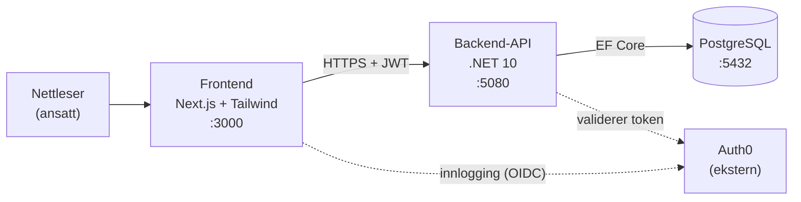
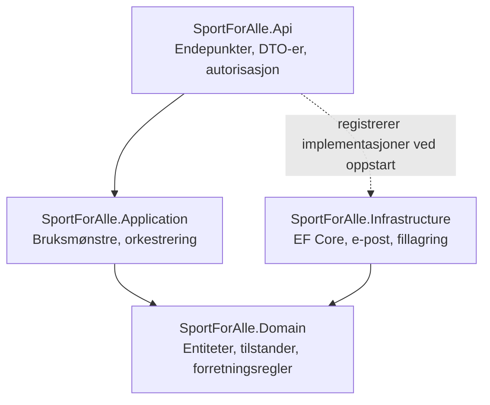
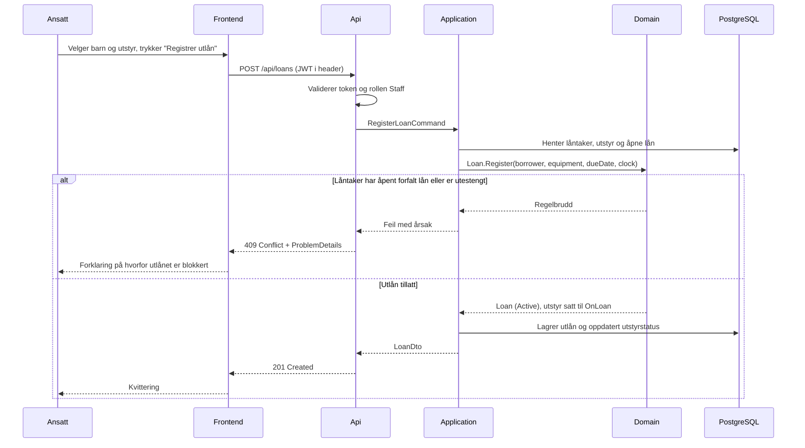

# Arkitektur

## Overordnet

Systemet er en trelagsapplikasjon: en frontend, et backend-API og en database.
Alt ligger i ett repositorium (monorepo), og alle tre lagene kjøres samtidig
lokalt med Docker Compose.



Frontend snakker aldri med databasen direkte. All datatilgang går gjennom API-et,
slik at forretningsreglene håndheves ett sted.

## Hvorfor monorepo

Frontend og backend ligger i samme repositorium fordi de utvikles av én person i
ett tempo og endres ofte sammen. Et endepunkt og siden som bruker det kan da
endres i samme commit, og CI kan bygge og teste hele systemet mot samme versjon.
Se [ADR-0001](./adr/0001-monorepo.md).

```
Fagprove/
├── backend/          .NET-løsning
├── frontend/         Next.js-applikasjon
├── docs/             Dokumentasjon (denne mappen)
├── .claude/          AI-instrukser og skills
├── .github/          CI-pipeline
├── docker-compose.yml
└── CLAUDE.md         Instruksfil for Claude Code
```

## Backend: lagdeling

Backend er delt i fire prosjekter. Avhengighetene peker innover: ytre lag kjenner
indre lag, aldri omvendt.



| Prosjekt | Ansvar | Kjenner til |
| --- | --- | --- |
| `Domain` | Entiteter, enums, tilstandsoverganger og forretningsregler. Ren C# uten rammeverk. | Ingenting |
| `Application` | Bruksmønstre som "registrer utlån" eller "registrer retur". Definerer grensesnittene infrastrukturen må oppfylle. | `Domain` |
| `Infrastructure` | EF Core `DbContext`, migrasjoner, e-postsending, lagring av bilder. Implementerer grensesnittene fra `Application`. | `Domain`, `Application` |
| `Api` | HTTP-endepunkter, DTO-er, modellvalidering, autorisasjon, feilhåndtering. | `Application` |

### Hvorfor denne lagdelingen

Den viktigste regelen i systemet er at et nytt utlån blokkeres når låneren har et
åpent forfalt lån eller er utestengt. Den regelen må gjelde uansett hvor utlånet
registreres fra. Ved å legge regelen i `Domain` kan den ikke omgås ved å kalle
API-et direkte, og den kan enhetstestes uten database, HTTP eller Auth0.

Lagdelingen gjør også at databasevalget er byttbart: `Domain` vet ikke at
PostgreSQL finnes.

## Frontend: struktur

Next.js med App Router. Serverkomponenter er standard; klientkomponenter brukes
bare der det trengs interaktivitet.

```
frontend/src/
├── app/
│   ├── (auth)/           Innlogging og utlogging
│   └── (dashboard)/      Beskyttet område - utstyr, brukere, utlån, rapporter
├── components/           Gjenbrukbare UI-komponenter
├── lib/                  API-klient, autentisering, hjelpefunksjoner
└── types/                Delte TypeScript-typer for API-svar
```

Alt under `(dashboard)` er beskyttet i middleware, ikke ved å skjule knapper. En
uinnlogget bruker som skriver inn URL-en direkte blir sendt til innlogging.

## Dataflyt: registrering av et utlån

Eksempelet viser hvordan lagene henger sammen, inkludert det tilfellet der
regelen slår inn.



## Automatisk forfall

Forfall skal oppdages uten at ansatte gjør noe. Det finnes to måter:

1. **Beregnet ved lesing** - et lån er forfalt dersom `DueDate` er passert og
   `ReturnedAt` er tom. Ingen bakgrunnsjobb, alltid korrekt.
2. **Bakgrunnsjobb** - en jobb som med jevne mellomrom setter `Status = Overdue`
   på lån som har passert fristen.

Systemet bruker begge: statusen beregnes ved lesing slik at oversikten aldri
viser feil, og en bakgrunnsjobb skriver statusen til databasen slik at forfall
kan brukes i rapporter og spørringer. Det unngår at oversikten er avhengig av at
en jobb faktisk har kjørt. Se [ADR-0011](./adr/0011-automatisk-forfall.md).

## Kjøremiljø

Alle tre lagene kjøres i Docker Compose, slik at miljøet er likt hver gang.

| Tjeneste | Port | Beskrivelse |
| --- | --- | --- |
| `frontend` | 3000 | Next.js |
| `api` | 5080 | .NET-API |
| `db` | 5432 | PostgreSQL med navngitt volum for data |

Konfigurasjon settes med miljøvariabler, dokumentert i `.env.example`. Se
[`11-utviklingsmiljo.md`](./11-utviklingsmiljo.md) for oppsett og kjøring.

## Videre lesning

- Domenemodellen og reglene: [`03-domenemodell.md`](./03-domenemodell.md)
- Databaseskjema: [`04-databasedesign.md`](./04-databasedesign.md)
- Autentisering: [`06-autentisering.md`](./06-autentisering.md)
