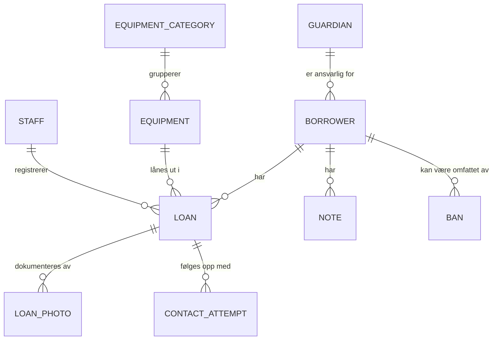
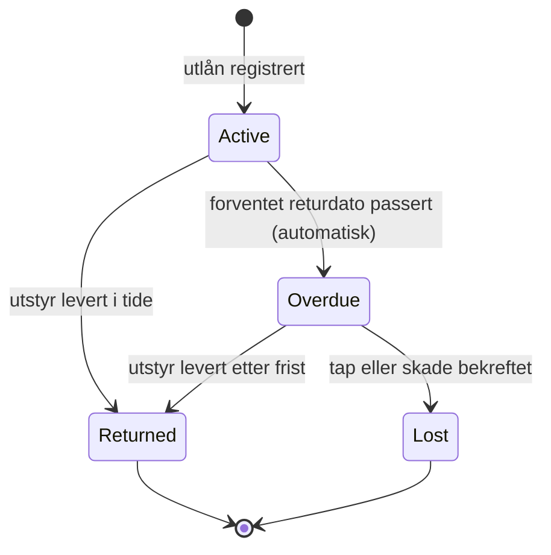
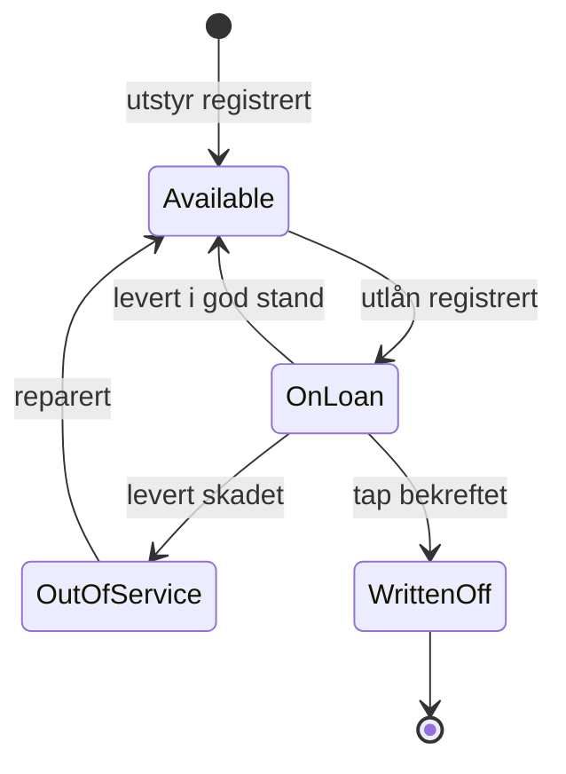
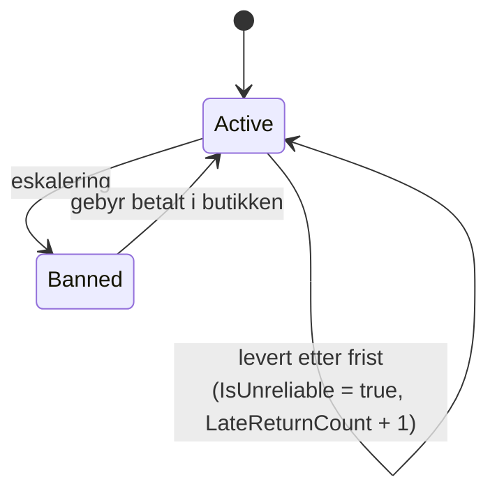
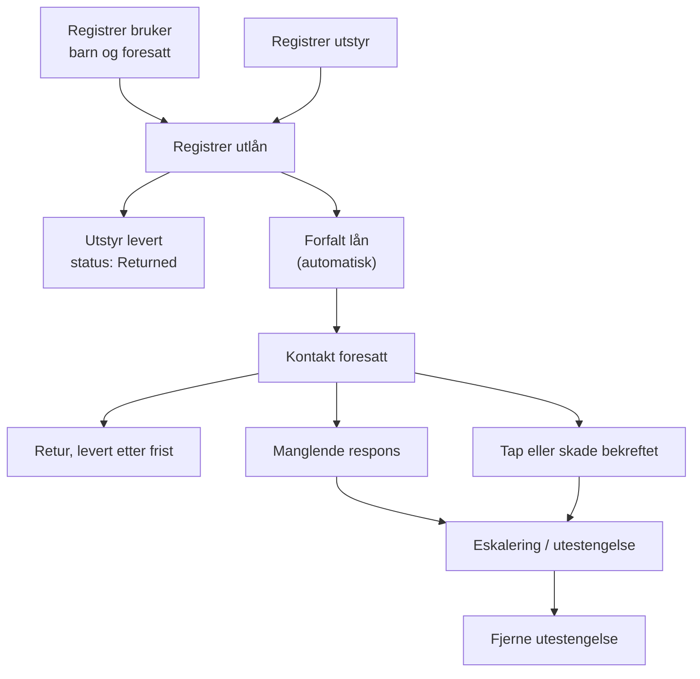

# Domenemodell

Dette dokumentet beskriver begrepene systemet er bygget på, tilstandene de kan ha
og reglene som gjelder mellom dem. Det fysiske databaseskjemaet er beskrevet i
[`04-databasedesign.md`](./04-databasedesign.md).

Modellen er utledet fra arbeidsflyten for ansatte, som er beskrevet lenger ned i
dokumentet.

## Entiteter

| Entitet | Norsk | Beskrivelse |
| --- | --- | --- |
| `Guardian` | Foresatt | Voksen som er ansvarlig for ett eller flere barn. Har kontaktinformasjon og kontaktes ved forfall. |
| `Borrower` | Barn / låntaker | Barnet som låner utstyret. Har fødselsdato og er knyttet til en foresatt. Har ikke egen innlogging. |
| `Equipment` | Utstyr | En fysisk gjenstand med internt serienummer, kategori, tilstand og status. |
| `EquipmentCategory` | Kategori | Gruppering av utstyr, brukt i rapportering (for eksempel ski, sykkel, skøyter). |
| `Loan` | Utlån | Kobling mellom et barn og et utstyr i en periode, med forventet returdato. |
| `LoanPhoto` | Bilde | Bilde av utstyret, tatt før utlån og ved retur. Dokumentasjonsgrunnlag. **Ikke bygget ennå** - krever et valg av lagringsløsning (blob/bøtte) som ikke er tatt. Se [`04-databasedesign.md`](./04-databasedesign.md). |
| `ContactAttempt` | Kontaktforsøk | Ett forsøk på å nå foresatt om et forfalt lån, med dato, metode og resultat. |
| `Note` | Notat | Fritekstnotat som ansatt skriver om en låntaker. |
| `Ban` | Utestengelse | En periode der låntakeren ikke får låne, med årsak og eventuell gebyrbetaling. |
| `Staff` | Ansatt | Ansatt i butikken. Knyttet til en Auth0-bruker. |

### Sentrale felter

**`Borrower`**

| Felt | Type | Merknad |
| --- | --- | --- |
| `DateOfBirth` | dato | Brukes til aldersgruppe i rapporter og til å sjekke 3-18 år. Fødselsnummer lagres aldri. |
| `LateReturnCount` | heltall | Antall ganger levert etter frist. Økes ved hver forsinket retur. |
| `IsUnreliable` | boolsk | Markering av at låntakeren har levert for sent tidligere. |
| `GuardianId` | fremmednøkkel | Påkrevd. Et barn uten foresatt kan ikke låne. |

**`Guardian`**

| Felt | Type | Merknad |
| --- | --- | --- |
| `IdentityVerifiedAt` | tidspunkt, valgfri | Satt når ansatt har bekreftet foresattes ID (navn og fødselsdato) fysisk i butikken ved registrering. Tom betyr ikke bekreftet ennå - **valgfritt, blokkerer ikke registrering**. Prosjektets alternativ til å lagre fødselsnummer, se `09-lover-og-regler.md`. |

**`Loan`**

| Felt | Type | Merknad |
| --- | --- | --- |
| `StartedAt` | tidspunkt | Når utlånet ble registrert. |
| `DueDate` | tidspunkt | Forventet returdato. |
| `ReturnedAt` | tidspunkt, valgfri | Tom så lenge lånet er aktivt. |
| `DaysLate` | heltall | Antall dager for sent, beregnet ved retur. |
| `Status` | enum | Se tilstandsmaskinen under. |

## Tilstandsmaskiner

De tre tilstandsmaskinene er systemets viktigste invarianter. En tilstandsendring
som ikke følger en pil under er en feil.

### Lånestatus (`LoanStatus`)

| Tilstand | Norsk | Betydning |
| --- | --- | --- |
| `Active` | Aktivt | Utlånet løper, fristen er ikke passert. |
| `Overdue` | Forfalt | Fristen er passert og utstyret er ikke levert. Blokkerer nye utlån. |
| `Returned` | Levert | Utstyret er levert tilbake. |
| `Lost` | Tapt | Utstyret er bekreftet tapt eller ødelagt, og saken er flagget for erstatning. |

### Utstyrstatus (`EquipmentStatus`)

| Tilstand | Norsk | Betydning |
| --- | --- | --- |
| `Available` | Ledig | Kan lånes ut. |
| `OnLoan` | Utlånt | Er ute på et aktivt lån. |
| `OutOfService` | Ut av drift | Skadet, må repareres før det kan lånes ut igjen. |
| `WrittenOff` | Tapt / avskrevet | Tapt eller kassert. Kan ikke lånes ut. |

### Låntakerstatus

Merk skillet: **upålitelig** er en markering, ikke en tilstand. En upålitelig
låntaker får fortsatt låne, men ansatte ser advarselen. En **utestengt** låntaker
får ikke låne i det hele tatt. De to må ikke slås sammen.

## Arbeidsflyt for ansatte

Diagrammet under viser hele arbeidsflyten ansatte går gjennom i systemet.

Hva hvert steg registrerer:

| Steg | Registreres |
| --- | --- |
| **Registrer bruker** | Kontaktinformasjon til foresatt, barnets navn og fødselsdato, kobling mellom barn og foresatt. |
| **Registrer utstyr** | Navn, kategori, tilstand, status, internt serienummer. |
| **Registrer utlån** | Velg barn og utstyr som er ledig. Sjekk for åpent forfalt lån eller markering. Starttidspunkt og forventet returdato. Bilde av utstyret før utlån. Utstyrstatus settes til `OnLoan`. |
| **Forfalt lån** | Automatisk sjekk om forventet returdato er passert. Lånestatus settes til `Overdue` og lånet markeres i dashbordet. |
| **Kontakt foresatt** | E-post eller telefon om at utstyret må leveres, eller at det må sies fra hvis noe er ødelagt. Kontaktforsøk logges med dato, metode og resultat. |
| **Retur etter frist** | Bilde av utstyret ved retur, returtidspunkt, antall dager for sent. `LateReturnCount` økes og låntakeren markeres som upålitelig. Utstyrstatus settes ut fra tilstand. |
| **Manglende respons** | Nytt kontaktforsøk registreres, antall mislykkede forsøk telles, saken sendes til eskalering. |
| **Tap eller skade bekreftet** | Lånestatus `Lost`, utstyrstatus `WrittenOff`, saken flagges for erstatning. |
| **Eskalering** | Låntaker settes til `Banned`, årsak registreres som notat, nye utlån blokkeres. |
| **Fjerne utestengelse** | Gebyr registrert betalt i butikken, utestengelsen oppheves. |

## Forretningsregler

Reglene håndheves i domenelaget, ikke i grensesnittet.

1. **Foresatt er påkrevd.** Et barn kan ikke låne før en foresatt er registrert og
   koblet til barnet. Håndheves ved registrering: `POST /api/borrowers` krever
   enten en eksisterende `guardianId` eller nok informasjon til å opprette en ny
   foresatt i samme kall - et barn kan rett og slett ikke opprettes uten, se
   `05-api.md`.
2. **Blokkering av nye utlån.** Et utlån avvises dersom låntakeren har minst ett
   lån med status `Overdue`, eller er utestengt. Dette er kjernemekanismen i
   løsningen på problem 1.
3. **Utstyret må være ledig.** Kun utstyr med status `Available` kan lånes ut.
4. **Alder.** Låntakeren må være mellom 3 og 18 år. Håndheves ved registrering av
   barnet (`POST /api/borrowers`, `422 BorrowerOutsideAgeRange`), ikke ved hvert
   utlån - en forenkling tatt bevisst for denne omgangen. Konsekvensen er at et
   barn som blir eldre enn 18 år mens det fortsatt står i systemet, ikke blir
   blokkert fra å låne av alder alene; det er ikke bygget noen periodisk
   kontroll av dette.
5. **Bilde ved utlån og retur.** Begge deler er dokumentasjonsgrunnlag for
   erstatningskrav og utestengelser. **Ikke håndhevet i CRUD-laget bygget
   2026-09-04** - `POST /api/loans` og `POST /api/loans/{id}/return` krever i dag
   ikke bilde, fordi lagringsløsningen for bilder ikke er valgt ennå (samme
   begrunnelse som for `LoanPhoto` i `04-databasedesign.md`). Et bevisst,
   dokumentert gap, ikke en forglemmelse.
6. **Kontaktforsøk logges alltid** med dato, metode og resultat, slik at ansatte
   ser om foresatt allerede er kontaktet.
7. **Forfall oppdages automatisk.** Ansatte skal aldri måtte sjekke manuelt.
   Forfall regnes på kalenderdato, ikke eksakt klokkeslett - et lån med
   forfallsdato i dag er først forfalt fra og med i morgen, se
   [ADR-0011](./adr/0011-automatisk-forfall.md).
8. **Opphevelse av utestengelse krever registrert gebyrbetaling.**

Regel 2 og regel 7 er de to som løser hovedproblemet systemet er laget for, og
er de viktigste å enhetsteste.

## Rapportering

Det er **to** rapporter. Begge bygger på de samme fem tallene:

| Rad | Grunnlag |
| --- | --- |
| Utlån totalt | `Loan.StartedAt` innenfor perioden |
| Levert i tide | `Loan.Status` er `Returned` og `Loan.DaysLate` er 0 |
| Levert for sent | `Loan.Status` er `Returned` og `Loan.DaysLate > 0` |
| Ikke levert | `Loan.Status` er `Overdue` eller `Lost` |
| Fortsatt aktive | `Loan.Status` er `Active` |

| Rapport | Grunnlag |
| --- | --- |
| Utlån i perioden | De fem tallene over, for hele perioden |
| Utlån per aldersgruppe | De samme fem tallene, fordelt med `Borrower.DateOfBirth` mot `Loan.StartedAt` |

**Alle fem tallene teller lån med `StartedAt` i perioden.** Det er det som gjør
at de fire underradene alltid summerer seg nøyaktig til totalen: `LoanStatus`
har akkurat disse fire verdiene, så ingen lån faller utenfor. Alternativet -
å telle lån som ble *levert* for sent i perioden - blander to forskjellige sett
med lån, og da slutter tallene å gå opp.

I tillegg vises antall utlån per dag, uke eller måned, som grunnlag for
søylediagrammet på rapportsiden. Det er en oppdeling av det første tallet, ikke
en egen rapport.

**Mest utlånte utstyr er ikke lenger en rapport.** Den sto her tidligere, men
ble tatt ut 2026-09-07: oppdragsgiver trenger antall utlån, ikke hva som ble
lånt ut. Endepunktet `GET /api/reports/popular-equipment` finnes fortsatt og er
testet, men ingenting viser det.

Aldersgruppene er **3-7 år**, **8-12 år** og **13-18 år**. Inndelingen er avklart
med oppdragsgiver og skal brukes uendret i rapportene. (Tidligere versjoner av
denne dokumentasjonen oppga 3-6 / 7-12 / 13-18. Det var en feil, rettet
2026-09-07.)

Alder regnes på utlånstidspunktet (`Loan.StartedAt`), ikke på rapporttidspunktet.
Et barn som fyller 13 år etter at lånet ble registrert telles altså i gruppen det
tilhørte da lånet skjedde, slik at historiske tall ikke endrer seg over tid.

Alle rapporter er aggregerte og viser ikke enkeltpersoner, se
[`09-lover-og-regler.md`](./09-lover-og-regler.md).

## Ordliste norsk til engelsk

Koden bruker engelske navn, grensesnittet norske. Denne tabellen er fasiten, og
er speilet i `CLAUDE.md`.

| Norsk | Engelsk i kode |
| --- | --- |
| Utlån | `Loan` |
| Utstyr | `Equipment` |
| Kategori | `EquipmentCategory` |
| Barn / låntaker | `Borrower` |
| Foresatt | `Guardian` |
| Ansatt | `Staff` |
| Lånestatus | `LoanStatus` |
| Utstyrstatus | `EquipmentStatus` |
| Forventet returdato | `DueDate` |
| Returtidspunkt | `ReturnedAt` |
| Aktivt | `Active` |
| Forfalt | `Overdue` |
| Levert | `Returned` |
| Ledig | `Available` |
| Utlånt | `OnLoan` |
| Ut av drift | `OutOfService` |
| Tapt / avskrevet | `Lost` / `WrittenOff` |
| Upålitelig | `IsUnreliable` |
| Antall dager for sent | `DaysLate` |
| Utestengt | `Banned` |
| Utestengelse | `Ban` |
| Gebyr | `Ban.FeePaidAt` (felt, ikke egen type) |
| Kontaktforsøk | `ContactAttempt` |
| Notat | `Note` |
| Tilstand | `EquipmentCondition` |
| Låntakerstatus | `BorrowerStatus` |
| Serienummer | `SerialNumber` |
| Rapport | `Report` |
| Kommune | `Municipality` |
