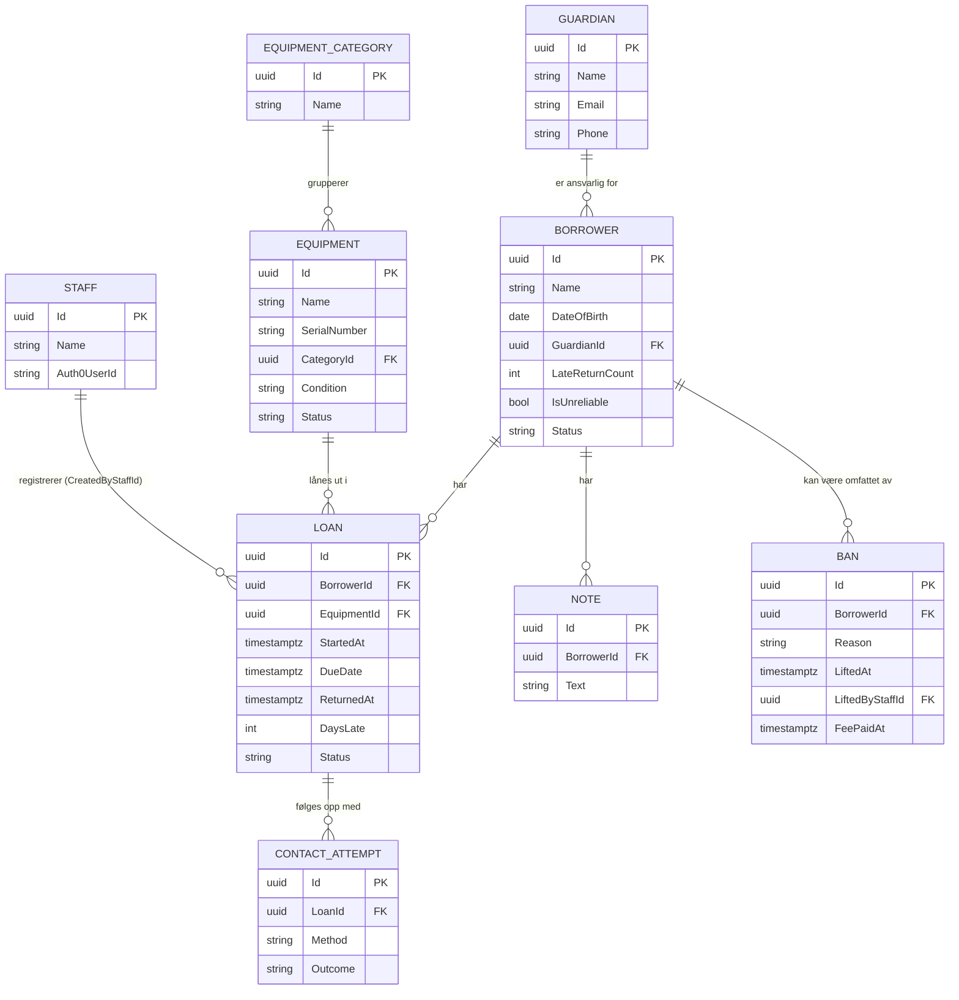

# Databasedesign

Skjemaet er utledet fra domenemodellen i
[`03-domenemodell.md`](./03-domenemodell.md). Autentisering (Auth0, roller) er
ikke bygget ennå - det er neste steg. Utstyrsbilder (`LoanPhoto`) er utsatt til
en lagringsløsning (blob/bucket) er valgt, se begrunnelsen under.

## Valg av database

PostgreSQL, se [ADR-0004](./adr/0004-postgresql.md).

## Tilnærming: Code First

Skjemaet defineres som C#-klasser i `SportForAlle.Api/Models/`, med
tabellkonfigurasjon i `SportForAlle.Api/Data/Configurations/`, og genereres til
tabeller med EF Core-migrasjoner. Databasen endres aldri manuelt - alle endringer
går gjennom en migrasjon som ligger i versjonskontroll sammen med koden.

Migrasjonene ligger i `SportForAlle.Api/Data/Migrations/`.

Se [ADR-0005](./adr/0005-ef-core-code-first.md).

## Tabeller

| Tabell | Innhold |
| --- | --- |
| `Staff` | Ansatte. `Name` og en valgfri `Auth0UserId` som kobles på når autentisering bygges. |
| `Guardians` | Foresatte, med navn, e-post og telefon. |
| `Borrowers` | Barn: navn, fødselsdato, kobling til én foresatt (`GuardianId`), `LateReturnCount`, `IsUnreliable` og `Status` (`Active`/`Banned`). |
| `EquipmentCategories` | Kategorier for gruppering og rapportering. |
| `Equipment` | Utstyr: navn, serienummer (unikt), kategori, tilstand (`Condition`) og status. |
| `Loans` | Utlån: start, forfallsdato, retur, status og `DaysLate`. |
| `ContactAttempts` | Kontaktforsøk mot foresatt om et utlån, med metode og resultat. |
| `Notes` | Fritekstnotater om en låntaker. |
| `Bans` | Utestengelser: årsak, tidspunkt for oppheving, hvem som opphevet den, og når gebyret ble registrert betalt. |

**`LoanPhoto` er ikke bygget i dette skjemaet.** Domenemodellen forutsetter
bilde av utstyret før utlån og ved retur (forretningsregel 5 i
`03-domenemodell.md`), men det krever en beslutning om hvor bildene faktisk
lagres (blob-lagring, en bøtte, eller noe annet) som ikke er tatt ennå. Å
legge til en `LoanPhotos`-tabell med et lagringsfelt før den beslutningen
finnes, ville bygget skjema mot en løsning ingen har valgt. Planlagt som
senere arbeid.

Hver tabell over har i tillegg fire felles kolonner fra `AuditableEntity`:
`CreatedAt`, `CreatedByStaffId`, `UpdatedAt`, `UpdatedByStaffId`. Se
[ADR-0014](./adr/0014-revisjonsfelter-pa-alle-entiteter.md) og "Nøkler og
relasjoner" under.

## ER-diagram



Revisjonskolonnene (`CreatedAt`, `CreatedByStaffId`, `UpdatedAt`,
`UpdatedByStaffId`) finnes på alle entitetene over, men er utelatt fra
diagrammet for lesbarhet.

## Nøkler og relasjoner

| Relasjon | Kardinalitet | Påkrevd | Ved sletting | Hvorfor |
| --- | --- | --- | --- | --- |
| `Guardian` → `Borrower` | 1 til mange | Ja (`Borrower.GuardianId`) | `Restrict` | Et barn kan ikke eksistere uten foresatt (forretningsregel 1). En foresatt med barn knyttet til seg kan ikke slettes før barna er flyttet eller fjernet. |
| `EquipmentCategory` → `Equipment` | 1 til mange | Ja (`Equipment.CategoryId`) | `Restrict` | En kategori med utstyr i seg skal ikke kunne forsvinne under utstyret - utstyret må omkategoriseres først. |
| `Borrower` → `Loan` | 1 til mange | Ja | `Restrict` | Utlånshistorikk er grunnlaget for rapportering til kommunen og må overleve selv om en låntaker slettes. Reell sletting av en låntaker med historikk krever anonymisering, ikke fjerning av raden - se [`09-lover-og-regler.md`](./09-lover-og-regler.md). |
| `Equipment` → `Loan` | 1 til mange | Ja | `Restrict` | Samme begrunnelse som over: lånehistorikk må bestå selv om utstyret fjernes fra systemet. |
| `Loan` → `ContactAttempt` | 1 til mange | Ja | `Cascade` | Et kontaktforsøk har ingen mening uten lånet det gjelder. |
| `Borrower` → `Note` | 1 til mange | Ja | `Cascade` | Et notat handler om låntakeren og har ingen selvstendig verdi uten dem - se innsynsretten i [`09-lover-og-regler.md`](./09-lover-og-regler.md). |
| `Borrower` → `Ban` | 1 til mange | Ja | `Cascade` | En utestengelse er meningsløs løsrevet fra låntakeren den gjelder. |
| `Staff` → `*.CreatedByStaffId` / `*.UpdatedByStaffId` | 1 til mange, valgfri | Nei (nullbar) | `SetNull` | Feltene er tomme til autentisering er bygget (ADR-0014), og skal ikke hindre at en tidligere ansatt fjernes fra `Staff`. |
| `Staff` → `Ban.LiftedByStaffId` | 1 til mange, valgfri | Nei (nullbar) | `SetNull` | Samme begrunnelse som over. |

I tillegg håndhever `Bans` at en låntaker ikke kan ha mer enn én aktiv
utestengelse samtidig, som en unik, filtrert indeks - se under.

## Indekser

| Indeks | Type | Hvorfor |
| --- | --- | --- |
| `Loans (Status, DueDate)` | Vanlig | Oversikten over forfalte lån er systemets mest brukte spørring. |
| `Loans (BorrowerId, Status)` | Vanlig | Sjekken for åpent forfalt lån gjøres ved hvert nye utlån - kjernemekanismen i forretningsregel 2. |
| `Equipment (SerialNumber)` | Unik | Serienummer identifiserer én fysisk gjenstand. |
| `Staff (Auth0UserId)` | Unik | Én Auth0-bruker skal ikke kunne kobles til mer enn én ansatt. |
| `Bans (BorrowerId)` hvor `LiftedAt IS NULL` | Unik, filtrert | Håndhever i databasen, ikke bare i `Borrower.Ban()`, at en låntaker ikke kan ha to aktive utestengelser samtidig. |

## Datatyper og konvensjoner

- **Primærnøkler er `Guid`**, generert av entiteten selv, ikke av databasen.
  Se [ADR-0013](./adr/0013-guid-primaernokler.md) for begrunnelsen -
  hovedsakelig at ressurs-id-er for barn og foresatte ikke skal være
  gjettbare i en URL.
- **Tidspunkter lagres som `timestamptz`** (UTC på formen `DateTimeOffset` i
  koden). Konvertering til norsk tid skjer i grensesnittet.
- **`Borrower.DateOfBirth` lagres som `date`** (`DateOnly` i koden), ikke
  `timestamptz` - det er en dato, ikke et tidspunkt.
- **Enums lagres som tekst**, ikke tall (`HasConversion<string>()`), slik at
  databasen er lesbar direkte og en ny verdi ikke forskyver betydningen av
  eksisterende rader.
- **Navnekonvensjon:** Tabeller er flertallsform av entitetsnavnet
  (`Borrowers`, `Loans`), med unntak av `Equipment` og `Staff` som er ubøyelige
  i flertall på engelsk. Kolonner er PascalCase, identisk med C#-egenskapen.
- **Revisjonsfelter** (`CreatedAt`, `CreatedByStaffId`, `UpdatedAt`,
  `UpdatedByStaffId`) kommer fra en felles `AuditableEntity`-baseklasse, se
  [ADR-0014](./adr/0014-revisjonsfelter-pa-alle-entiteter.md).

## Migrasjoner

```bash
dotnet ef migrations add <Navn> \
  --project SportForAlle.Api \
  --startup-project SportForAlle.Api \
  --output-dir Data/Migrations

dotnet ef database update \
  --project SportForAlle.Api \
  --startup-project SportForAlle.Api
```

| Migrasjon | Dato | Endring |
| --- | --- | --- |
| `InitialCreate` | 2026-09-02 | Oppretter `EquipmentCategories` med `Id` (identity) og `Name` (`varchar(100)`, unik). Første migrasjon, laget for å verifisere at EF Core, migrasjoner og Docker-databasen henger sammen. |
| `AddCoreDomainEntities` | 2026-09-03 | Oppretter `Staff`, `Guardians`, `Borrowers`, `Equipment`, `Loans`, `ContactAttempts`, `Notes` og `Bans`, med relasjonene og indeksene beskrevet over. Endrer `EquipmentCategories.Id` fra `int` (identity) til `Guid`, og legger revisjonsfeltene til på alle tabeller, inkludert `EquipmentCategories`. |

## Testdata

Ikke bygget ennå. Planlagt som en seed-rutine som kjører i utviklingsmiljøet,
adskilt fra migrasjoner, med oppdiktede navn og kontaktinformasjon - se
prinsippet i [`07-testing.md`](./07-testing.md).
