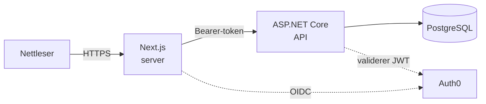

# Utviklerhåndbok - å overta og videreutvikle løsningen

Dette dokumentet er inngangsporten for en utvikler eller en IT-avdeling som
skal **overta prosjektet og bygge videre på det**.

Det forklarer ikke systemet på nytt. Resten av `docs/` gjør allerede det, og to
beskrivelser av samme sak kommer garantert til å sprike etter noen måneder.
Håndboken gjør fire andre ting:

1. Får deg fra `git clone` til et kjørende system.
2. Sier **hva som faktisk er bygget, per lag** - og hva som ikke er det.
3. Samler fellene som har kostet tid, så du slipper å finne dem selv.
4. Sier hva som gjenstår før dette kan settes i drift, og hva som er de
   naturlige neste stegene.

> **Hva dette er:** et **forslag til en løsning**, ikke et produksjonssystem.
> Det er et bevisst valg, ikke en mangel - se
> [`README.md`](./README.md). Avstanden fra forslag til drift er beskrevet i
> [Fra forslag til drift](#fra-forslag-til-drift), ikke skjult.

**Status per:** 2026-09-07.

---

## Kom i gang

Den korte veien. Detaljene, og hvorfor oppsettet er som det er, står i
[`11-utviklingsmiljo.md`](./11-utviklingsmiljo.md).

Du trenger .NET 10 SDK, Bun, Docker Desktop og en Auth0-konto.

```bash
git clone <repo> && cd Fagprove
cp .env.example .env          # fyll inn Auth0-verdiene
docker compose up -d db       # databasen, på vertsport 5433

# Backend - http://localhost:5080
cd backend/SportForAlle.Api && dotnet run

# Frontend - http://localhost:3000 (eget terminalvindu)
cd frontend && bun install && bun dev
```

Databasen kjører i Docker. **Backend og frontend kjører lokalt**, ikke i
containere - se [Fra forslag til drift](#fra-forslag-til-drift).

Sjekk at alt virker:

```bash
cd backend && dotnet test          # 219 tester
cd frontend && bun run test        # 98 tester
```

---

## Systemet i korte trekk

Tre deler: en Next.js-frontend, et ASP.NET Core-API og en PostgreSQL-database.
Nettleseren snakker aldri direkte med API-et - den går gjennom Next.js, som
holder tilgangstokenet på serversiden
([ADR-0015](./adr/0015-proxied-backend-for-frontend.md)).



Backend er en **lagdelt monolitt** - ett prosjekt, delt i mapper, uten
repository-lag ([ADR-0012](./adr/0012-lagdelt-monolitt.md)). Kontrollere kaller
tjenester; bare tjenester rører `AppDbContext`. Forretningsreglene ligger på
entitetene selv, som har private settere, slik at en ugyldig tilstandsovergang
ikke kompilerer utenfor entiteten.

Full gjennomgang: [`02-arkitektur.md`](./02-arkitektur.md). Domenemodellen og
tilstandsmaskinene: [`03-domenemodell.md`](./03-domenemodell.md).

---

## Status per lag

Dette er kjernen i dokumentet. For hvert lag: hva som er bygget, hva som ikke
er det, og hvor det er dokumentert.

### Backend

**Bygget.** Alle endepunktene under er implementert og dekket av
integrasjonstester mot en ekte database. Se
[`05-api.md`](./05-api.md) for full kontrakt.

| Område | Endepunkter |
| --- | --- |
| Låntakere | CRUD, utestengelse (`ban`, `ban/fee-paid`, `DELETE ban`), notater |
| Utstyr | CRUD, samt hierarkiske kategorier med egen CRUD |
| Foresatte | Liste, hent, opprett, oppdater |
| Utlån | Liste, hent, opprett, `return`, `mark-lost`, kontaktforsøk, oppfølgings-e-post |
| Rapporter | `loans`, `age-groups`, `timeline`, `popular-equipment` |
| Ansatte | Liste, opprett, `link-me`, `me` |
| Drift | `health` |

Forfall settes automatisk av en bakgrunnsjobb
(`OverdueLoanBackgroundService`), i tillegg til å beregnes ved lesing - se
[ADR-0011](./adr/0011-automatisk-forfall.md). Feil returneres som RFC 7807
`ProblemDetails` fra én global handler
([ADR-0017](./adr/0017-global-exception-handler.md)).

**Ikke bygget.**

| Mangler | Hvorfor |
| --- | --- |
| Rollebasert autorisasjon | Ingen rolle-claim finnes i tokenet, se [ADR-0019](./adr/0019-staff-auth0-mapping.md). I dag har enhver innlogget og koblet ansatt full tilgang |
| Filopplasting og bildelagring | Lagringsløsning er ikke valgt, se [`04-databasedesign.md`](./04-databasedesign.md). Dette blokkerer forretningsregel 4 (bilde før utlån og ved retur) |
| Revisjons-/aktivitetslogg som endepunkt | **Under arbeid 2026-09-07.** To sider i grensesnittet venter på det |
| Utestengelseshistorikk som egen liste | `Borrower.Status` dekker «er utestengt nå», som er det detaljsiden trenger i dag |
| Sletting av personer | Krever anonymisering, ikke fjerning av rader, fordi utlånshistorikken er grunnlaget for rapportering - se [`09-lover-og-regler.md`](./09-lover-og-regler.md) |

### Frontend

**Bygget.** Velkomstskjerm, oversikt, utlån (tabell, kanban og detaljside),
utstyr (med kategoritre og detaljside), barn og foresatte (med detaljside,
utestengelse og notater), ansatte, logg og rapporter - pluss dialogene for nytt
utlån, retur, nytt utstyr, registrer barn, kontaktforsøk og bekreftet tap.

Server-komponenter leser direkte fra backend; klientkomponenter skriver gjennom
proxyen ([ADR-0020](./adr/0020-server-lesing-klient-skriving.md)).

**Slik er `/dashboard` faktisk beskyttet:** `app/dashboard/layout.tsx` er en
server-komponent som henter sesjonen og gjør `redirect('/auth/login')` hvis den
mangler. Fordi alle sidene ligger under det layoutet, er de beskyttet før noe
rendres - ikke ved at knapper skjules. `src/proxy.ts` kjører Auth0 sin
`middleware()` og håndterer sesjon og innloggingsruter, men **blokkerer ikke**
forespørsler av seg selv; det står eksplisitt i kommentaren i filen. Blander du
de to, er det lett å tro at en ny rute utenfor `/dashboard` er beskyttet uten
at den er det.

**Ikke bygget.** Det som mangler backend-støtte vises fortsatt i
grensesnittet, men merket med «Ikke bygget ennå» og en forklaring i en tooltip
(`components/not-built-yet.tsx`) - bevisst, framfor å fjerne det stille.

| Mangler | Merknad |
| --- | --- |
| Bildeopplasting | Vises som stiplede bokser. Venter på backend |
| Innhold i loggsiden | Venter på revisjonslogg-endepunktet |
| Invitasjon av ansatte | I dag oppretter og kobler hver ansatt sin egen profil |
| Paginering | Alle rader rendres samtidig. Greit i denne datamengden, et reelt hull hvis listene vokser |
| Responsivt design | Alle 15 skjermbildene i designet er tegnet på fast 1440px bredde. Ingenting er sagt om smalere vinduer |
| Mørk modus | Tokens finnes i `globals.css`, men designet er kun laget i lys modus, og ingen har bedt om det |
| Laste- og tomtilstander | Ikke designet. `Skeleton` finnes som utgangspunkt |

> **Kjent avvik funnet 2026-09-07:** oversiktssiden viser fortsatt merkelappen
> «Kontaktforsøk-logging finnes ikke i API-et ennå» i tabellen over forfalte
> lån. Det stemmer ikke lenger - endepunktet finnes, og lån-detaljsiden bruker
> det. Merkelappen er utdatert og bør fjernes.

### Database

PostgreSQL 17 i Docker, publisert på **vertsport 5433**. Code First med EF Core
([ADR-0005](./adr/0005-ef-core-code-first.md)); skjemaet endres bare gjennom
migrasjoner. Primærnøkler er alltid `Guid`, generert av entiteten selv
([ADR-0013](./adr/0013-guid-primaernokler.md)), og alle entiteter har
revisjonsfelter ([ADR-0014](./adr/0014-revisjonsfelter-pa-alle-entiteter.md)).

Fire migrasjoner, alle anvendt: `InitialCreate`, `AddCoreDomainEntities`,
`AddEquipmentCategoryHierarchy`, `AddGuardianIdentityVerification`. Se
[`04-databasedesign.md`](./04-databasedesign.md) for tabeller og ER-diagram.

**Ikke på plass:** testdata som kan lastes inn (databasen starter tom, så
skjermbilder og demoer krever manuell registrering), og ingen rutine for
sikkerhetskopiering eller gjenoppretting.

### Autentisering

Auth0 med OIDC mot frontend og JWT bearer mot backend
([ADR-0006](./adr/0006-auth0.md)). API-et har en global fallback-policy som
krever autentisert bruker, så et nytt endepunkt er beskyttet med mindre noen
aktivt åpner det. En `Staff`-profil må være koblet til Auth0-kontoen før
domenedata kan nås ([ADR-0019](./adr/0019-staff-auth0-mapping.md)).

**Viktig for den som overtar:** rolleinndelingen `User` / `Staff` / `Admin` som
er beskrevet i `CLAUDE.md` og [`06-autentisering.md`](./06-autentisering.md) er
**en plan, ikke noe som håndheves i dag**. Det finnes ingen rolle-claim i
tokenet. Dette er den største avstanden mellom det dokumentasjonen beskriver og
det koden gjør, og det er derfor første punkt under neste steg.

### Kjøremiljø og CI

`docker-compose.yml` starter **bare databasen**. Backend og frontend kjøres
lokalt med `dotnet run` og `bun dev`. Det finnes ingen Dockerfile for noen av
dem.

CI (GitHub Actions, `.github/workflows/ci.yml`) kjører på hver push:

- **Backend:** restore, `build -warnaserror`, anvend migrasjoner mot en
  PostgreSQL-tjeneste, `dotnet test`, `dotnet format --verify-no-changes`.
- **Frontend:** `bun install --frozen-lockfile`, `lint`, `test`, `build`.

Det finnes **ingen deploy-jobb**. CI beviser at koden bygger og at testene går,
ikke at noe kan settes i drift.

---

## Kjente feller

Disse har alle kostet tid minst én gang. De står her fordi de ikke er åpenbare.

| Felle | Symptom | Løsning |
| --- | --- | --- |
| **Feil databaseport** | `password authentication failed for user "sportforalle"`, selv om Docker-oppsettet er riktig | Databasen ligger på **5433**, ikke 5432. En lokalt installert PostgreSQL holder ofte 5432, og tilkoblingen treffer da den i stedet. Sjekk porten i `.env` før noe annet |
| **Filelås ved bygging** | `MSB3021: Unable to copy ... because it is being used by another process` | En kjørende `dotnet run` holder `SportForAlle.Api.exe`. Stopp den, bygg, start den igjen |
| **`dotnet run --no-launch-profile`** | Applikasjonen binder til port 5000, ikke 5080, og krasjer hvis 5000 er opptatt | Porten kommer fra launch-profilen. Kjør `dotnet run` uten flagget |
| **`dotnet format --nologo`** | `The file '--nologo' does not appear to be a valid project or solution file` | `dotnet format` godtar ikke `--nologo`. Kjør `dotnet format SportForAlle.sln --verify-no-changes` |
| **Navneregel på private felter** | `IDE1006: Naming rule violation: Missing prefix: '_'` ved `dotnet format` | Private felter og konstanter skal ha `_`-prefiks (`_maximumBuckets`), også `const` |
| **shadcn CLI skriver feil import** | Nye `ui/`-filer importerer `cn` fra `"cn"` i stedet for `@/lib/utils` | Rett importen manuelt. Sjekk dette først hvis en `shadcn add` feiler, se [ADR-0016](./adr/0016-shadcn-ui.md) |
| **`middleware.ts` finnes ikke** | Du leter etter rutebeskyttelse og finner ingen middleware | Next.js 16 har døpt om `middleware.ts` til **`proxy.ts`** (`frontend/src/proxy.ts`). Se også `frontend/AGENTS.md`: denne Next-versjonen avviker flere steder fra eldre oppskrifter |
| **Foreldet tilstand i dev-server** | Endring slår ikke gjennom, eller styling ser urendret ut, uten at koden forklarer det | Turbopack og `dotnet run` har begge produsert dette. Stopp helt, `rm -rf .next`, start på nytt - før du feilsøker videre |
| **EF Core-versjon** | Konflikt på `Microsoft.EntityFrameworkCore.Relational` når testprosjektet bygges | EF Core er låst til **10.0.4** fordi Npgsql-provideren 10.0.3 er bygget mot den. Versjonene følger provideren |
| **Rapporttester som slår feil tilfeldig** | En test feiler bare noen ganger | Testklasser kjører parallelt mot **én delt database**. Rapporttester sammenligner derfor «minst» framfor eksakte tall, og teller bare tall som ikke kan gå ned. Se [`07-testing.md`](./07-testing.md) |

---

## Fra forslag til drift

Ingenting av dette er påbegynt. Listen er ærlig ment: den er avstanden fra
dagens tilstand til noe som kan kjøre for ekte brukere.

| Må på plass | Hvorfor |
| --- | --- |
| **Containerisering** | Det finnes ingen Dockerfile for backend eller frontend. `docker-compose.yml` kjører bare databasen |
| **Driftsmiljø** | Ingen vertsplattform er valgt, og det finnes ingen miljøer utover lokal maskin |
| **Hemmelighetshåndtering** | Alt leses fra én delt `.env` i repoets rot. Et driftsmiljø trenger et ekte hemmelighetslager |
| **HTTPS/TLS** | Merket «Planlagt» i [`08-sikkerhet.md`](./08-sikkerhet.md). Ikke satt opp |
| **Rollebasert autorisasjon** | Se over. Uten den er tilgangsstyringen grovere enn dokumentasjonen beskriver |
| **Sikkerhetskopiering** | Ingen rutine for backup eller gjenoppretting av databasen |
| **Logging og overvåking** | Ingen mottaker for logger er valgt. Merk at personopplysninger aldri skal logges |
| **Databehandleravtale og DPIA** | Ligger eksplisitt utenfor omfanget av dette forslaget, se [`09-lover-og-regler.md`](./09-lover-og-regler.md). Må gjøres før systemet behandler ekte opplysninger om barn |
| **Ende-til-ende-tester** | Ingen verktøy er valgt. Hele arbeidsflyten er ikke testet samlet |

---

## Mulige neste steg

Forslag, ikke bestillinger. Størrelsen er et grovt anslag for én utvikler.

### 1. Rollebasert autorisasjon - middels

Legg en rolle-claim i Auth0-tokenet og håndhev `Staff`/`Admin` på hvert
endepunkt. **Hvorfor først:** det er den største avstanden mellom det
dokumentasjonen lover og det systemet gjør, og alt annet som legges til arver
problemet. Berører Auth0-oppsett, `Program.cs`, alle kontrollere, og
ansatte-siden i frontend.

### 2. Bildelagring ved utlån og retur - stor

**Hvorfor:** dette er forretningsregel 4, og bildene er hele bevisgrunnlaget
for erstatningskrav og utestengelser. Uten dem er utestengelsesmekanismen
svakere enn den er beskrevet. Krever et reelt valg av lagringsløsning (og en
ADR), håndtering av filopplasting gjennom proxyen, og en personvernvurdering -
husk at det er **utstyret som fotograferes, aldri barnet**.

### 3. Revisjons-/aktivitetslogg - middels

**Under arbeid 2026-09-07.** Loggsiden og «Siste hendelser» på oversikten
venter begge på dette endepunktet.

### 4. Paginering - liten til middels

**Hvorfor:** hver tabell henter og rendrer alle rader. Det holder i dagens
datamengde og blir et problem lenge før det blir kritisk. Berører
listeendepunktene og de fire tabellsidene.

### 5. Responsivt design - middels

**Hvorfor:** designet finnes bare i 1440px. En ansatt med nettbrett i butikken
er et realistisk scenario som ingen har tegnet ennå. Sidemeny, tabeller og
modaler må alle vurderes.

### 6. Ende-til-ende-tester - middels

**Hvorfor:** enhets- og integrasjonstestene er gode, men ingen test går gjennom
hele arbeidsflyten i grensesnittet. Verktøy må velges først (og få en ADR).
Den mest verdifulle testen er den fulle syklusen: registrer, la forfalle, følg
opp, returner for sent, kontroller at nytt utlån blokkeres.

### 7. Containerisering og drift - stor

**Hvorfor:** se [Fra forslag til drift](#fra-forslag-til-drift). Dette er
jobben som gjør forslaget til et system.

---

## Dokumentasjonskart

Les i denne rekkefølgen hvis du er ny:

| Rekkefølge | Dokument | Hva du får |
| --- | --- | --- |
| 1 | [`01-losningsbeskrivelse.md`](./01-losningsbeskrivelse.md) | Problemene systemet finnes for |
| 2 | [`03-domenemodell.md`](./03-domenemodell.md) | Begreper, tilstandsmaskiner, forretningsregler |
| 3 | [`02-arkitektur.md`](./02-arkitektur.md) | Lagdeling og dataflyt |
| 4 | [`11-utviklingsmiljo.md`](./11-utviklingsmiljo.md) | Oppsett, filstruktur, CI |
| 5 | [`05-api.md`](./05-api.md) og [`04-databasedesign.md`](./04-databasedesign.md) | Kontrakten og skjemaet |
| 6 | [`09-lover-og-regler.md`](./09-lover-og-regler.md) | Personvern - les før du rører data om barn |

Resten ved behov: [`06-autentisering.md`](./06-autentisering.md),
[`07-testing.md`](./07-testing.md), [`08-sikkerhet.md`](./08-sikkerhet.md),
[`12-lisenser-og-vilkar.md`](./12-lisenser-og-vilkar.md),
[`13-frontend-designsystem.md`](./13-frontend-designsystem.md).

**Hvorfor noe er som det er, står i [`adr/`](./adr/).** 23 beslutninger, hver
med alternativene som ble vurdert og forkastet. Begynn der før du reverserer
noe - og skriv en ny ADR som erstatter den gamle hvis du gjør det.

### Hvordan holde dokumentasjonen levende

Regelen som har holdt dette oppdatert så langt: **et dokument oppdateres i
samme endring som koden det beskriver.** Utsatt dokumentasjon blir enten feil
eller blir aldri skrevet. En ny pakke føres inn i
[`12-lisenser-og-vilkar.md`](./12-lisenser-og-vilkar.md) når den installeres,
ikke i en opprydding til slutt.

Prosjektet har også ferdige arbeidsflyter for Claude Code i `.claude/skills/`
(`backend-endpoint`, `ef-migration`, `frontend-page`, `adr`, `documentation`,
`do-work`). De beskriver stegene for å legge til et endepunkt, lage en
migrasjon eller en side - derfor gjentas ikke de stegene her.
